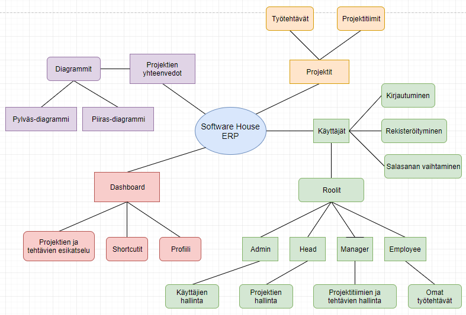
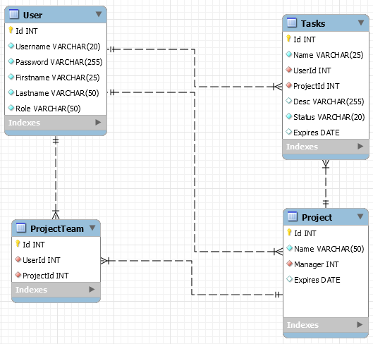

# SwH-ERP

- Päivitetty: 3.12.2018

- Web- ja web-palvelinohjelmoinnin sulautettu harjoitustyö

## Tekijät

- Eetu Aaltonen - L5192
- Nestori Poikolainen - L5027
- Matti Aho - K9251

## Toimivia testikäyttäjiä

Käyttäjänimi  | Salasana  | Rooli
--------------|-----------|-------------
pekka         | sala1234  | Head
peetu         | sala1234  | Manager
mikko         | sala1234  | Työntekijä (täältä löytyy parhaiten dataa)
pirkko        | sala1234  | Työntekijä
saku          | sala1234  | Työntekijä

- Tässä on pieni tietoturvariski, että pidämme kaikki salasanat samoina, mutta näin kouluprojektissa se ei ollut tärkeimmässä roolissa.

## Johdanto

Toimeksiantona oli luoda ohjelma käyttäen kurssilta opittuja asioita. Päätimme yhdistää Web-palvelin ja web-ohjelmoinnin kurssien harjoitustyön yhdeksi kokonaisuudeksi.
Me otimme haasteen vastaan ja lähdimme melkein tyhjästä opiskelemaan omatoimisesti ASP.NET Corea ja mm. Semantic UI:ta.
Matilla oli jo aikaisempaa osaamista .NET Coresta ja hän auttoi meidät muut hyvin alkuun.

SwH ERP on projektien sekä työntekijöiden hallinta- ja seurantatyökalu. Se tarjoaa käyttäjien, projektien, projektitiimien ja työtehtävien hallintatyökalut
sekä alkeelliset projektien ja työtehtävien seurantaan tarvittavat raportointityökalut.

Software House ERP:ssä on neljä roolia, jotka määräävät käyttäjän oikeudet.
Mitä käyttäjä pystyy tekemään? Mille sivuille käyttäjä pääsee?

Rooli     | Oikeudet
----------|-----------
Admin     | Eli ylläpitäjä. Pystyy rekisteröimään uusia käyttäjiä ja selaamaan olemassa olevia
Head      | Eli johtohenkilö. Pystyy luomaan uusia projekteja, selaamaan kaikkia olemassa olevia projekteja ja näkemään kaikkien projektien yhteenvedot
Manager   | Eli projektipäällikkö. Pystyy luomaan uusia tehtäviä, hallitsemaan projektitiimejä sekä selaamaan projekteja ja projektien yhteenvetoja, joissa toimii projektipäällikkönä
Employee  | Eli työntekijä. Tekee hänelle osoitetut tehtävät, pystyy selaamaan kaikkia työtehtäviään ja projektejaan sekä näkemään omien projektien yhteenvedot

## Kielet ja kirjastot

- ASP.NET Core
- C#
- Razor syntaksit
- SQL kyselyt: Entity Framework + LINQ
- Bcrypt.net

- CSS: Semantic UI
- JavaScript: jQuery + jQuery UI
- Diagrammit: Charts.js

## Ohjelman rakenne

## Tietokantarakenne

## Mitä opimme ja missä kehityimme

- Istuntojen hallinta .NET:n tarjoamilla teknologioilla
- Salasanojen oikeaoppinen ja turvallinen tallentaminen ja hallinta Bcrypt.net kirjastolla
- Monimutkaiset, jopa neljän taulun tietokantakyselyt LINQ + Lambda syntakseilla (Entity Framework)
- HTML DOM -puun reaaliaikainen päivittäminen jQuerylla
- Käyttäjien oikeuksien mukaan rajattujen sivujen/näkymien hallinta
- Asiakaspään interactiot ja riittävä ohjelman tilan informointi. Esim. virheet, onnistunut muutosten tallentaminen, virheelliset syöteet

## Kehitettävää / asioita, joita emme kerinneet tekemään

- Tiedon poistaminen tietokannasta. Tämän hetkisellä ohjelmalla voi vain lisätä ja päivittää tietoa tietokantaan
- Tarkistukset ettei tietokantaan voisi tallentaa samaa tietoa kahteen kertaan
- Kunnollinen syötteiden tarkistus ennen SQL kyselyä, EF kyllä suojaa injektioilta mutta syöte voi silti olla melkein mitä vain
- Kunnollinen virheiden käsittely try-catchin avulla
- Sivujen Authorize tarkistuksen niputtaminen, niin että [Authorize(Roles = "X")] loitsu tarvitsisi kirjoittaa vain kerran joka roolille
- Toistuvien koodien siirtäminen funktioiksi, joita voidaan kutsua monesta eri paikasta
- Käyttäjien oikeudet ja roolit/työtehtävät olisi ollut järkevämpää erottaa toisistaan: eli käyttäjällä olisi ollut erikseen "permissions level" (0-3) ja "role" (esim. Manager)

## Arvioidut Työtunnit

Tekijä  | ~Tuntia
--------|-------
Eetu    | 96h
Nestori | 30h
Matti   | 20-30h

## Työnjako

Osa-alue                   | Tekijä
---------------------------|-----------
Suunnittelu                | Koko tiimi
Tietokantarakenteet        | Koko tiimi
Käyttöliittymä + Grafiikka | Koko tiimi
Toiminnallisuudet          | Koko tiimi
Tietokantakyselyt          | Koko tiimi

## Oma Arvosana

Tekijä  | PHP Arvosana | JavaScript Arvosana | Perustelut
--------|--------------|---------------------|-------------------------------------------
Eetu    | 5            | 5                   | Tämä projekti opetti minulle paljon. Opin hyvin lyhyessä ajassa ASP .NET Coren alkeet ja monien tarjolla olevien kirjastojen (mm. Semanti UI:n) käytön. Osaan kirjoittaa monimutkaisia tietokantahakuja ja hallitsen hyvin .NET:n controllerit ja näkymät. Panostin todella paljon tähän projektiin ja käytin hyvin paljon omaa aikaa, mikä näkyi myös lopputuloksessa.
Nestori | 3            | 3                   | Minulle ASP .NETin oppiminen lyhyessä ajassa tuotti vähän vaikeuksia. Alkuun päästyäni osaan kirjoittaa yksinkertaisia controllereita, näkymiä ja tietokantahakuja. Hallitsen tarjolla olevien kirjastojen (mm. Semanti UI:n) alkeet.
Matti   | 5            | 3                  | Tämä framework olikin minulle jo ennalta tuttu joten opittavaa nyt ei hirveästi ollut. Entity Frameworkkia ja käyttäjien autentikointia rakentaessa tuli kyllä opittua hieman frameworkin syvempää toimintaa ja kuinka eri palat niputtuvat yhteen. Ohjastin myös muuta ryhmää tarpeen vaatiessa käyttämään frameworkkia omien kykyjeni mukaan mahdollisimman sujuvasti.
